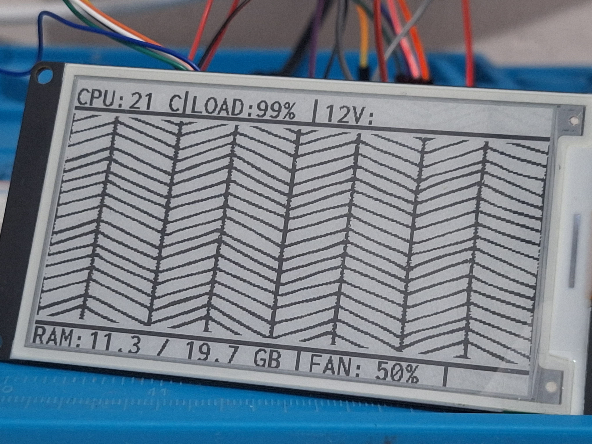

# CasemodESP32 

### This project aims to provide a system for my casemod. It involves sending PWM signals to control fans, monitoring the power supply and its temperature, and displaying data on an e-paper screen.

> #### Disclaimer: This project is completely amateur; I am not a profissional programmer. ChatGPT helped a lot with the process.<3 

```text
MSI MAG A600DN (600W)
│
├── 12V Rail
│   ├── Step-Up 12V → 19V
│   │   └── Acer Aspire 5 A515-57
│   │       └── ESP32 Monitoring System
│   │           ├── ePaper Display
│   │           ├── Temperature Sensors
│   │           └── Fan Controller
│   │
│   ├── R43SG eGPU Adapter NVME
│   │   └── NVIDIA RTX 2060
│   │
│   └── 120 mm Cooling Fans
│
└── Monitoring & Telemetry
    └── ESP32
        ├── USB Serial Link
        ├── Hardware Monitoring
        └── ePaper Dashboard
```

First, a Python script retrieves CPU, temperature, and workload data (via the LibreHardwareMonitor DLL API). Then, the WMI library retrieves only the system's RAM usage.<br> The Python script determines the fan speed based on the configured curve, helping to cool the system.

Technically, it's quite easy to do the same thing on Linux; you wouldn't need LibreHardwareMonitor.

The ESP32 receives a struct via serial containing five data points: CPU temperature, CPU load, target RPM, used RAM, and total RAM.

```   
    	{
    	"temp": 63,		# Temperature
    	"load": 8.0,	# CPU Load
    	"rpm": 40,		# fanRPM	
    	"uram": 11.6,	# RAM Usage
    	"tram": 19.7	# Total RAM 20GB
    	}
```
For fan control, only the target RPM would be necessary, but I also want to include an e-paper display showing some information on the machine's case.



```
Config:
	microcontroller : ESP32 30pin
	epaper display : WeaCT 3.7"
	Temperature sensor (comming soon): DS18B20
	Voltage Monitoring (coming soon): INA226
	OS: Windows 11 (for LibreHardwareMonitor)
```

### Task list
- [ ] Tray icon in the script (python)
- [ ] Add buzzer for bipping errors in the system (esp32)
- [ ] Add DS18B20 sensor for internal temperature monitoring (esp32)
- [ ] Add INA226 sensor for monitoring 12v line (esp32)